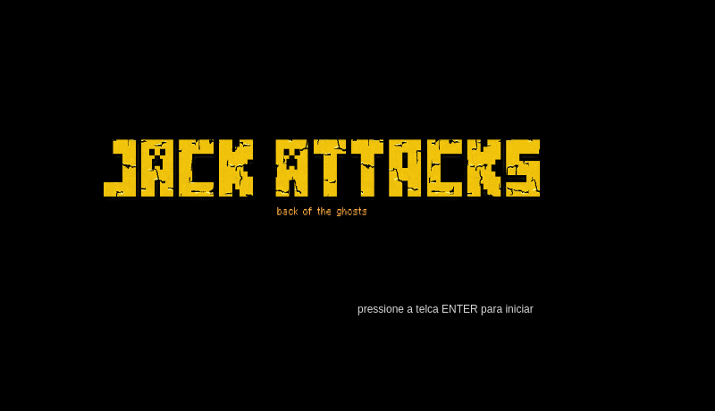
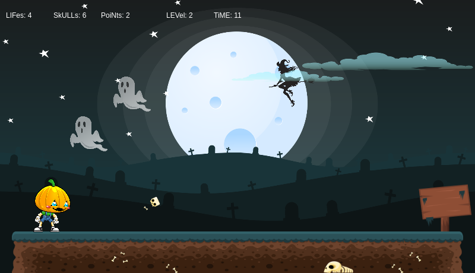
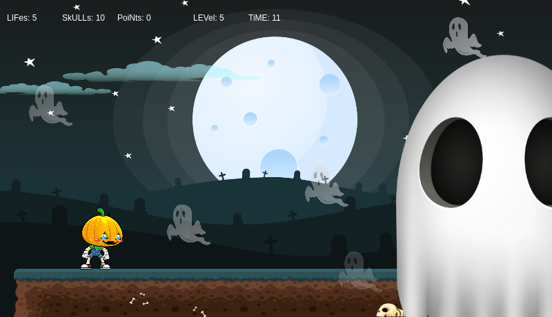
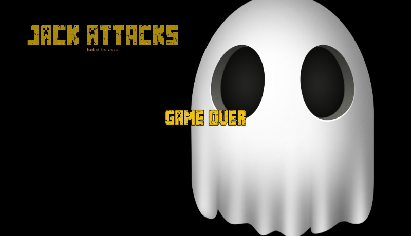

# Projeto final da disciplina Lógica de Programação (LoP) UFRN 2018.1
O objetivo deste trabalho é a implementação de um jogo eletrônico usando elementos gráficos em duas dimensões. Nele os alunos vão desenvolver suas competências no uso de estruturas de repetição, vetores, entrada e saída de dados e programação estruturada como um todo.

## CONFIGURAÇES DO DESENVOLVIMENTO
### Sistema operacional
Ubuntu 18.4 Long Term Support (LTS) (Bionic Beaver).

### Editor e plugins utilizados

Para esse projeto, foi utlizado o editor de texto Atom (1.26.1 x64) com seguintes pacotes:

-   atom-beautify
-   emmet
-   file-icons
-   highlight-selected
-   pigments
-   minimap-pigments
-   minimap

### Navegador padrão
Google Chrome 67.0.3396.87.

### Rodando Servidor HTTP Local

Algumas funcionalidades implementadas no projeto, tais como o carregamento de imagens e fontes customizadas, são esperadas a serem carregadas via SSH ou FTP. A Execução de um Servidor local pode reseolver esse problema.

Execute o seguinte comando via terminal dentro da pasta do projeto para criar um servidor HTTP para requisições do navegador.

```sh
$ sudo python -m SimpleHTTPServer
```

Para visualizar o projeto, abra seu navegador e acesse o endereço:

    127.0.0.1:8000 ou localhost:8000
    
> A não execução do Servidor local na pasta do jogo, poderá ocorrer um erro de origem cruzada. Visite a documentação do oficial em [P5.js Local Server].

## ESTRUTURA DO PROJETO
Após o download do arquivo no repositório, descompacte e entre na pasta descompactada.

Na pasta irá conter os arquivo index, README e a pasta _assets_, a qual possui todos os arquivos necessários para o carregamento completo do jogo.

Há três seções no arquivo index.

-   **Etapas concluídas:**
    - lista as etapas do projeto concluídas. Da etapa 1 a 10.
-   **Sketchs de estudos:**
    - são sketchs utilizadas para o estudo da P5.js. Foram trabalhados conceitos básicos como a criação de formas primitivas de círculos e retângulos a trabalho com imagens e funções disponíveis na biblioteca.
-   **Canvas com a última etapa implementada:**
    - espaço utilizado para o "desenho" do código implementado.

## SOBRE O JOGO
### Nome
JACK Attacks
### Personagem principal
Jack Cabeça de Lanterna.
### Demais personagens
Frankenstein, Ghosts e BigGhost (_Boss_).
### Níveis de dificuldade
1.  matar um fantasma;
2.  chegar ao final do cenário e tocar na placa sem sofrer nenhum _hit_;
3.  destruir o obstaculo no caminho até o amigo;
4.  resgatar o Frankenstein;
5.  matar o BigGhost.

### Controles
-   mover o jogador para esquerda (&larr;);
-   mover jogador para direita (&rarr;);
-   atirar - mouse esquerdo (&#9703;).

### Screenshots
<p>
    
    
    
    
</p>

## Referências
[P5.jsd](https://p5js.org/reference/)
[P5.Play](http://p5play.molleindustria.org/docs/index.html)

[atom]: https://atom.io/
[P5.js Local Server]: https://github.com/processing/p5.js/wiki/Local-server
